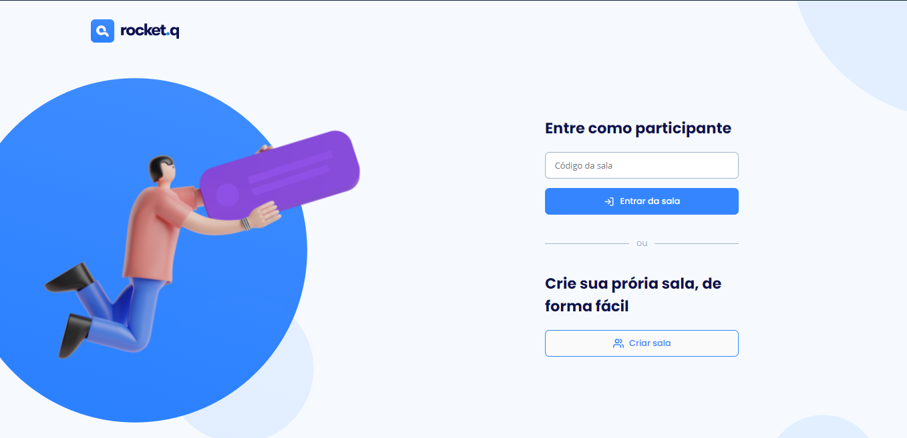
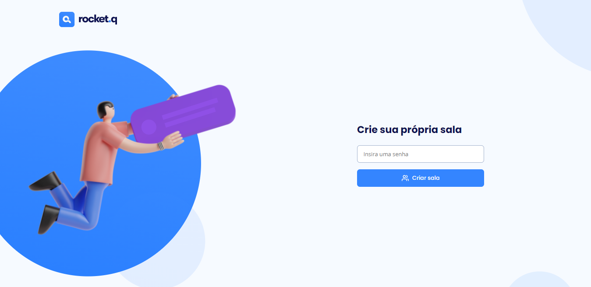
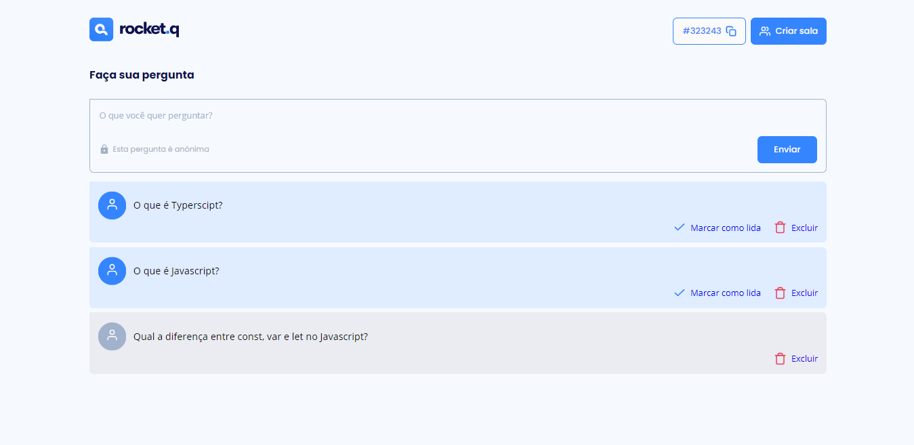

<h1 align="center">
 NLW_Together_Discover
</h1>

<h2 align="center">
Projeto desenvolvido durante a 6° edição da New Level Week da Rocketseat : Mission - Discover
</h2>

 

## 🚀 Tecnologias

Esse projeto foi desenvolvido com as seguintes tecnologias:

- HTML
- CSS
- JavaScript
- NodeJS
- EJS
- Express
- SQLite

## 💻 Projeto

O Belloinfo.Q é uma aplicação de interação através de perguntas, sendo possível criar uma sala para internautas anônimos fazerem perguntas e o criador da sala em posse de uma senha gerenciar essas perguntas e marcar como lidas.

 

Pagina Principal

 

Pagina criar sala

 

Pagina Sala das perguntas

 